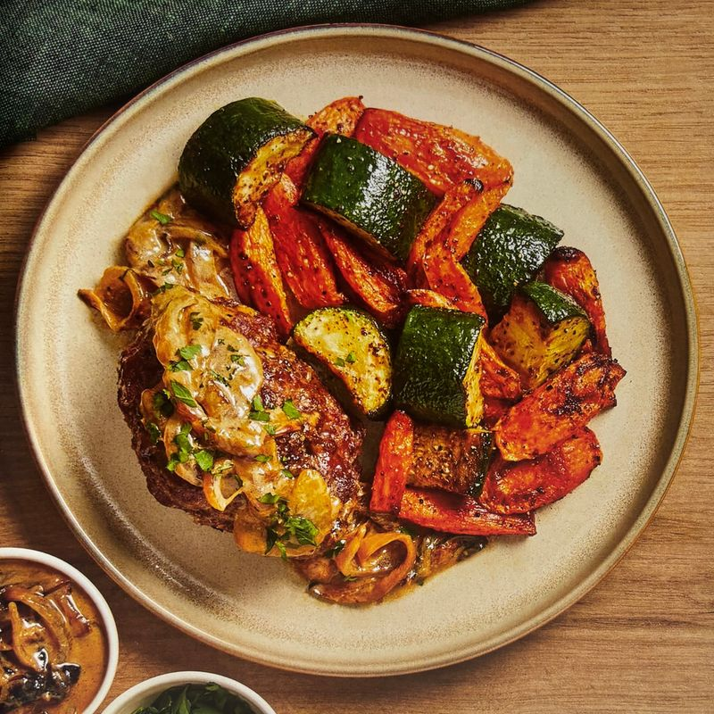
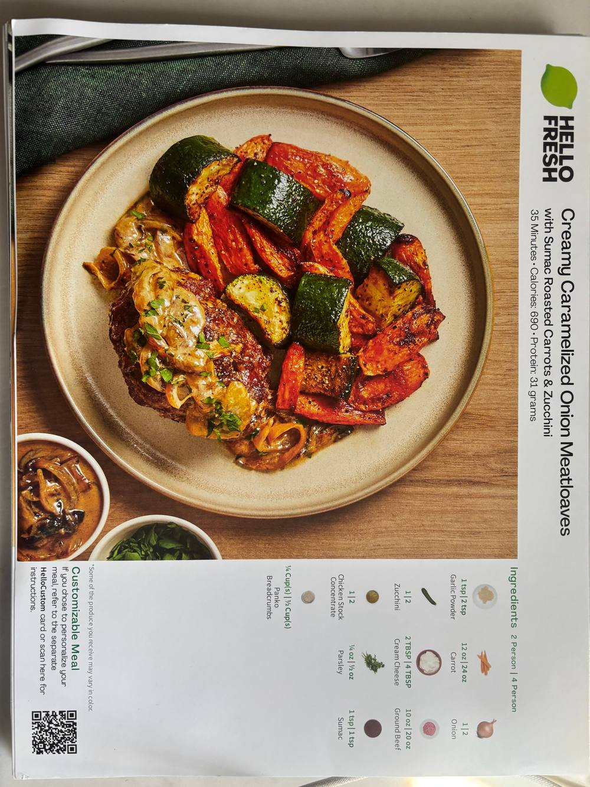

# 家庭週晚餐規劃 App

> 一套讓家人有選擇權的 AI 餐桌系統。跨食譜自由組合、AI 食譜解析、即時同步、自動採購清單。



---

## 緣起 — 從「今晚吃什麼？」這個大哉問開始

每天六點，我站在冰箱前，腦子一片空白。

小孩在旁邊問「媽媽今天吃什麼」，我回「你想吃什麼」，他說「不知道」。然後就是那個熟悉的循環：我決定、我煮、他吃兩口、剩下的我自己吃完。

這個循環持續了很多年。

我試過很多方法。Notion 上列了張「每週菜單」的表格，堅持了三週就放棄（每週日晚上又要想一次要煮什麼，等於沒解決問題）。HelloFresh 試了幾個月，好吃是好吃，但三個人吃兩人份不夠、吃四人份又浪費，而且每週能選的菜有限，一陣子就開始重複。Google 表單讓家人投票，家人的反應是：「你寄的那個網址怎麼打不開？」

問題的根本不是「沒有工具」，而是**沒有一套為我家量身設計的流程**。我需要的是：

- 家裡有固定幾樣我會做的菜，我不想每週重新想菜單
- 老公和小孩可以參與決定哪一天吃什麼，而不是被動接受
- 食材採購可以自動整理成清單，不要我週六去 Costco 前還要自己列
- 家人評分後，AI 幫我記住哪些受歡迎、哪些下次別再做了

於是開始寫自己的。兩個禮拜，從零到上線、家人實際在用。這篇文章記錄整個過程，也把專案開源出來 — 如果你家也有同樣的困擾，可以直接 clone 一份改成自己的。

---

## 為什麼不直接用 Notion / Excel / HelloFresh？

先說為什麼這個問題不能用現成工具解。

**Notion / Excel**：太靜態。它們能存資料，但不能做「即時同步」、不能「看家人目前選了什麼」、不能「一鍵產採購清單」。你要寫公式、寫 formula、手動複製，而我真正想要的是**一個流程引擎**，不是一張表。

**HelloFresh / Hello Chef**：太制式。他們的食譜好看、好吃，但你**沒辦法混搭** — 不能拿 A 食譜的主食配 B 食譜的肉配 C 食譜的菜。現實是我家冰箱有昨天剩的白飯、冷凍庫有一塊三層肉、菜市場今天買了大白菜，最自然的晚餐就是這三樣湊一起 — 但沒有一個 App 讓你這樣組。

**Google 表單 + 群組傳 Excel**：太分散。家人看到手機通知想選菜時，表單要切換分頁、填完又要我整理，一來一往半小時沒了。

我真正要的核心體驗是：

> 食譜庫裡的主食、肉、菜、醬料，**可以跨食譜自由組合**，家人打開手機就能即時看見今天可以選什麼、選完就送出、選完之後自動算出本週要買什麼。

這個需求，市面上沒有現成方案。只能自己寫。

---

## #01 技術選型 — 為什麼是這組

做之前我只給自己一個約束條件：**兩週內家人要能實際在用，任何工作量超過這個範圍的選擇都刪掉。**

基於這個約束，選型就很直接：

| 層級 | 選擇 | 為什麼 |
|------|------|--------|
| 框架 | **Next.js 16** (App Router) | 前後端一體，SSR 開箱即用，家人打開網址就能用 |
| 資料庫 + Auth | **Supabase** | Postgres + Auth + Realtime + Storage 四合一，不用各自接 |
| AI | **Claude Sonnet 4.6** | Vision API 解析食譜圖很準，中文處理自然 |
| 部署 | **Railway**（不是 Vercel） | 環境變數在 UI 上設定較直覺，家人用的內部工具不需要 Vercel 的 edge 網絡 |
| 樣式 | **Tailwind CSS v4** | 不需要設計系統，class 直接寫 |
| 語言 | TypeScript | 一個人寫家用 App，編譯器當我的第二雙眼睛 |

**沒選 Vercel 的理由**：不是因為 Vercel 不好，是因為 Railway 的心智模型更像我熟悉的「一台 server 跑一個 app」。家人用的內部工具每月流量很低，不需要 edge function，反而需要穩定的資料庫連線，Railway 裝 Postgres 更省心。

**沒選 Firebase 的理由**：RLS (Row Level Security) 是 Supabase 殺手鐧。每個 query 自動帶用戶權限過濾，不用在每個 API 層重複檢查，這對「一個人維護」的家用 App 太重要了。

**沒選 OpenAI 的理由**：Claude 的 Vision API 解析 HelloFresh 食譜卡（英文）並翻成繁體中文，品質比我試過的 GPT-4o 還穩。整篇文章後面會講到為什麼解析品質對這個 App 是生死線。

---

## #02 核心機制：Split 食譜 + 跨食譜組合

這是整個 App 最重要的設計決策。

**傳統食譜庫的做法**：一個食譜就是一道完整的菜。「蜂蜜芥末豬排飯」、「紅燒牛肉麵」、「青椒炒牛肉」... 每道菜自成一體。

**我的做法**：把食譜**拆成四個獨立的組件**：

```
一份「split 食譜」= 主食 + 肉 + 蔬菜 + 醬料（任一項都可以缺）

例：蜂蜜芥末豬排飯
  ├─ 主食：白飯
  ├─ 肉：蜂蜜芥末豬排
  ├─ 蔬菜：烤紅蘿蔔
  └─ 醬料：（無）
```

為什麼要這樣拆？因為這樣就可以**跨食譜組合**：

```
我今天可以選：
  ├─ 主食：蜂蜜芥末豬排飯「的白飯」
  ├─ 肉：紅燒牛肉麵「的紅燒牛肉」
  ├─ 蔬菜：青椒炒牛肉「的青椒」
  └─ 醬料：蔥油雞「的蔥油醬」
```

每一個新的組合，是一個**獨特的晚餐體驗**。系統會記錄它、給它一個 combination ID、累計次數、讓家人評分。評分資料最後變成 AI 推薦的依據。

資料庫長這樣（簡化）：

```sql
recipes           -- 食譜（有兩種 type: split / all_in_one）
recipe_components -- 組件（starch/meat/vegetable/sauce）
meal_combinations -- 跨食譜組合（自動累計 times_eaten）
combination_ratings -- 組合評分（1-5 星）
```

**有些菜不能這樣拆**：例如咖哩、火鍋、燉飯 — 所有食材一鍋煮，沒有獨立組件。這類就另外用 `type = 'all_in_one'` 標示，選餐時直接選整道菜。

這個決定看似小，但影響整個資料模型、整個 UI、整個選餐流程、整個 AI 推薦邏輯。**這是我想最久的一個設計**。

---

## #03 AI 怎麼幫我省力

家人用得再順，我如果每道新菜都要手動打食材清單、手動打烹調步驟，這個 App 兩週就會死在「管理員太累」上。

所以 AI 解析食譜是必備功能。三種輸入方式：

### 1. 貼一段文字
我在某個美食部落格看到食譜，整段複製貼上。Claude 解析出：標題、類型（split / all-in-one）、組件拆解、每個組件的食材 + 份量 + 單位、烹調步驟。

### 2. 貼一個 URL
貼一個食譜網址，後端抓 HTML、洗掉 script/style/標籤、剩下 8000 字送給 Claude 解析。

### 3. 丟一張圖
這是最重點。HelloFresh 食譜卡、食譜書翻拍、手寫菜單 — 都能解析。後面會專門講。

**AI 推薦**另一條路：管理員建立本週菜單時，可以按「AI 建議」，系統會把「家裡現有食材庫存 + 過去組合評分」餵給 Claude，問它：「根據這些資料，本週建議開放哪些食譜？」Claude 回傳 recipe_id 列表 + 每個的理由。管理員看了覺得合理就勾選、不合理就跳過。

AI 不做決定，AI 是第二意見。這是我對 AI 的基本態度。

---

## #04 週計畫 + 即時同步：讓全家一起決定

家人參與感是這個 App 的靈魂。實作重點：

**管理員流程**：
1. 每週日晚上，進 `/admin/week/new`
2. 選擇本週開放哪幾天選餐（平日 vs 週末、外食日排除）
3. 勾選本週可選的食譜（或按 AI 建議自動勾）
4. 按下「建立」→ 系統自動推 Web Push 通知給所有家人
5. 家人打開通知就到 `/` 看到一張張每日的選餐卡片

**家人流程**：
1. 手機收到通知「🍽️ 本週晚餐計畫已開放」
2. 點進來看到週一到週五每一天的卡片
3. 每天點「選餐」，看到可選的主食/肉/菜/醬料
4. 勾選組合 → 預覽（「這個組合已被做過 3 次，平均評分 4.3」）→ 送出
5. **其他家人的手機即時跳出更新**（Supabase Realtime）
6. 送錯想改？主選單自己那天的卡片右邊有「取消選擇」按鈕，點一下變回未選狀態，再選一次就好

即時同步是 Supabase 免費送的。我只寫了一個 `useEffect`：

```tsx
supabase.channel('week-${weekPlan.id}')
  .on('postgres_changes', { event: '*', table: 'meal_selections' }, refreshSlots)
  .subscribe()
```

Web Push 用 VAPID 金鑰 + `web-push` npm 套件實作，service worker 放在 `public/sw.js`。第一次讓家人打開 App 會跳「要不要開啟通知？」，點了之後就訂閱到資料庫。

---

## #05 自動採購清單

週五晚上管理員按「關閉本週」，系統做三件事：

1. 收集本週所有 `meal_selections` 的食材
2. 合併同名食材（兩道菜都用洋蔥 → 合併成一筆）
3. 依食材目錄 `ingredient_catalog` 判斷採購渠道（Costco / Weee! / Trader Joe's / Stop & Shop / 其他），分組顯示
4. 更新週狀態為 `closed`，跳出評分提示給家人

生成出來長這樣（打勾可以在手機上互動、列印版本會自動隱藏勾選控件）：

```
🛒 本週採購清單

▸ Costco
  ☐ 雞胸肉 2 lb
  ☐ 牛絞肉 1 lb
  ☐ 洋蔥 3 顆

▸ Weee!
  ☐ 白米 5 磅
  ☐ 醬油 1 瓶

▸ Stop & Shop
  ☐ 紅蘿蔔 1 lb
  ☐ 青江菜 1 把
```

這一步自動化後，我週六去採購的決策成本從 30 分鐘壓到 0。

---

## #06 我最得意的一招：34 張食譜卡 5 分鐘入庫

這是最近加的功能，也是我最開心的一個。

問題：我手邊有 17 份 HelloFresh 食譜卡，每份正反兩面 = 34 張圖。如果手動一張張拍照 → 手動輸入 → 校對，每份至少 10 分鐘，17 份 = 將近 3 小時。

解法：寫一個批量腳本，把正反兩張圖一起送給 Claude，讓它自己拼接出完整食譜。



流程：

```
34 張圖
   ↓ 依檔名排序，兩兩配對（正面+背面）
17 組配對
   ↓ 每組兩張圖一起送給 Claude Vision
   ↓ Claude 整合兩面資訊、翻譯成繁體中文、拆成 split 組件
Claude JSON 回傳
   ↓ sharp 裁切正面食物主圖（左 4% - 右 64%，上 12% - 下 92%）
   ↓ 上傳 Supabase Storage
圖片上傳
   ↓ 寫入 recipes + recipe_components + recipe_component_ingredients
完成
```

裁切後的食物主圖長這樣（從整張卡片只保留盤子部分）：


實際執行：17 組，16 組成功、1 組因為標題重複 skip、0 失敗。總時間 **4 分 30 秒**。

核心腳本只有 250 行（`scripts/batch-import-recipes.ts`），跑法：

```bash
# 1. 把食譜卡圖片依序放到 recipe-cards/ 資料夾
# 2. 設定 .env.local（SUPABASE + ANTHROPIC）
# 3. 跑：
node --env-file=.env.local --experimental-strip-types scripts/batch-import-recipes.ts

# 有 --limit 參數可以先測試 1 組再跑全部
node --env-file=.env.local --experimental-strip-types scripts/batch-import-recipes.ts --limit 1
```

關鍵細節：

**圖片壓縮** — Claude API 上限 5MB（base64 後），HelloFresh 原圖 4-5MB、base64 後爆 7MB。用 sharp 先 resize 到 1600px 寬 + JPEG quality 82，降到約 1-2MB。

**冪等性** — 每次執行會檢查 `recipes.title` 是否已存在，存在就 skip。這樣重跑安全、可以新增一批新的卡片而不會重複。

**失敗隔離** — 某組解析失敗（JSON 解析錯、API 超時）不會中斷整批，log 下來繼續下一組。

---

## #07 踩過的坑

兩週開發，踩到夠寫一本書。挑五個印象最深的：

### 坑 1：Claude JSON 在 2893 字元處截斷

解析一份複雜食譜時，後端一直報 `SyntaxError: Expected ',' or '}' at position 2893`。

原因：`max_tokens: 2048` 不夠，Claude 還沒輸出完整 JSON 就停了。

解法：調成 `max_tokens: 4096`。

教訓：**總是預留輸出上限的緩衝**。估計的時候算最壞情況、再乘 1.5。

### 坑 2：NULLS NOT DISTINCT 語法不支援

`meal_combinations` 要做跨食譜組合的去重，邏輯是「四個組件 ID 加起來視為唯一鍵」。但組件可能為 null（例如沒有醬料）。

SQL 標準寫法：
```sql
unique (starch_id, meat_id, veggie_id, sauce_id) nulls not distinct
```

這需要 PostgreSQL 15+，但 Supabase 當時還是 14。只好改用 COALESCE + sentinel UUID：

```sql
unique (
  coalesce(starch_id, '00000000-...'::uuid),
  coalesce(meat_id,   '00000000-...'::uuid),
  coalesce(veggie_id, '00000000-...'::uuid),
  coalesce(sauce_id,  '00000000-...'::uuid)
)
```

這個 workaround 醜但穩定，跑了幾個月沒出問題。

### 坑 3：管理員點「成員視角」整個網頁當機

Admin 有一個連結指向 `/`，目的是讓我以家人視角看一次再回管理後台。某次改動後，點下去整個瀏覽器空白。

原因：`src/app/page.tsx` 寫了 `redirect('/')` — 等於自己 redirect 到自己，無限迴圈。

解法：直接刪掉 `src/app/page.tsx`，讓 `(app)/page.tsx` 接手。

教訓：**App Router 的 route group `(app)` 不會建立 URL segment**，所以 `(app)/page.tsx` 本來就是 `/`。我多此一舉寫了一個頂層 `page.tsx`，自己蓋了自己。

### 坑 4：bash history expansion 毀了我半小時

這個最新鮮。我請 AI 幫我做 clean copy 時，AI 給我一條指令裡有 `!cd /Users/alice/projects/meal-planner-public && rm -rf .git`。我複製貼上，bash 把 `!cd` 解釋成 history expansion，抓到最近一次 cd 的參數，結果 `rm -rf .git` 在**原始專案**執行 — 辛苦累積的 git 歷史秒殺。

拯救：因為剛好早上有 push 到 GitHub，`git clone` 下來把 `.git` 搬回原位置。有驚無險。

教訓：**`!` 開頭的指令在 bash 是特殊字元**，給別人的示範指令不要以 `!` 開頭、或用單引號包起來。另一個教訓：**push 早、push 常、push 頻**。

### 坑 5：Web Push 在 iPhone 要先加到主畫面

搞定 VAPID、service worker、subscribe API 全部一切順利，家人在 Android / 電腦都收得到通知。只有 iPhone 家人說沒收到。

原因：iOS 的 Safari 對 Web Push 有特殊限制 — **必須先把網站加入「主畫面」變成 PWA，通知才會真的送達**。

解法：在首次訪問時顯示一個卡片，提示 iPhone 用戶「點右上角分享按鈕 → 加入主畫面」。搞定。

### 坑 6：Supabase embed 悄悄從 array 變 object，讓主選單莫名空白

這個最近才踩到，而且耽誤我兩個小時才抓到根因。

家人回報：送出選擇後回主選單，**什麼都沒顯示**。我自己重現：點任意一天送出 → 返回主選單 → 所有日期都是「尚未有人選擇」。再點同一天 → 拿到「被其他人選走了」的 23505 錯誤。

第一反應是 RLS 擋了 SELECT。檢查 policy：`auth.uid() is not null`，完全寬鬆。Supabase Dashboard 裡 `meal_selections` 也確實有 row。寫得進去、但讀不到 — 非常不合理。

加一行 `console.log` 到 server component 把查詢結果印到 Railway log，看到這個：

```
TypeError: (a.meal_selections ?? []).map is not a function
```

`meal_selections` 根本**不是 array**，是單一 object。`.map` 當然炸。

根因：PostgREST 判斷 embed 的 cardinality **不是看你怎麼寫查詢**，是看 FK 約束。

```sql
create table meal_selections (
  meal_slot_id uuid references meal_slots(id) unique,  -- 關鍵是這個 unique
  ...
);
```

`meal_slot_id` 有 `UNIQUE` → PostgREST 推斷 `meal_slots → meal_selections` 是 one-to-one → embed 自動回傳單一 object 或 null，不是 array。

而我全專案 9 個 consumer 都寫：

```ts
const selection = slot.meal_selections?.[0] ?? null
// 或
if (slot.meal_selections?.length > 0) { ... }
```

全部悄悄失效：
- 主選單取 `[0]` → `undefined` → 顯示「尚未有人選擇」
- `/select/:slotId` 的 pre-check `.length > 0` → `undefined > 0 = false` → 使用者在已被選走的 slot 仍看到表單 → 送出才撞 unique constraint（這就是那句誤導的 23505）

解法：`MealSlotWithSelection` 型別從 `meal_selections: (...)[]` 改成 `meal_selections: (...) | null`，9 個 consumer 統一改成直接存取。

教訓兩條：

**一、embed 的 cardinality 是 FK 約束決定的，不是查詢語法。** 一旦 child 表加 `unique` constraint，所有 embed 這張表的地方會被無聲影響，且 TypeScript 抓不到（我們手寫的型別是 array，runtime 回來的是 object，直到執行 `.map` 才爆）。要嘛接受它、要嘛把 unique 拿掉。

**二、「寫不進去的錯誤」不一定是寫入問題。** 這個坑的惡毒之處在：使用者看到「被別人選走」的錯誤，直覺認為是寫入衝突，實際上**前一次選擇早就寫進去了**，是 SELECT 讀不到才一直重試撞到 unique。錯覺差點害我從 INSERT 方向 debug 一整天。

---

## 你也可以自己部署一份 — 30 分鐘搞定

完整部署指引見 [`SETUP.md`](./SETUP.md)。濃縮版：

```
1. Clone 這個 repo
2. Supabase 建新專案 → 執行 supabase-schema.sql
3. Anthropic 拿 API key
4. 四個環境變數填 .env.local
5. 本機 npm run dev 試跑
6. 沒問題就連到 Railway，設環境變數，自動部署
7. Supabase 邀請家人信箱、第一個帳號設為 admin
8. 開始用
```

不會寫 code 也能跑，但你需要有：

- 一個 Supabase 帳號（免費額度夠家庭使用）
- 一個 Anthropic API 帳號（付費但每月家用大概 $1-3 USD）
- 一個 Railway 帳號（免費額度夠）
- **懂得複製貼上環境變數、懂得點 GitHub 連接 Railway**

如果以上都沒問題、或你有個工程師朋友 30 分鐘幫你搞定一次 — 這個 App 就是你的了。

---

## 結語

這個 App 我自己寫、自己家裡用，家人三個月下來的評分紀錄比我腦子記得清楚多了。

小孩第一次看到週一的卡片上有「你上週給蜂蜜芥末豬排打 5 分，本週要再點一次嗎？」時，眼睛亮起來了。那種「我說的話被記住了」的感覺，是 HelloFresh 沒給他的。

這種**為自己家寫的軟體**，商業上沒意義、投資人不會看、無法規模化。但它解決了一個真實的、具體的、我家的問題。而且解決得很漂亮。

**這就是寫軟體最爽的時刻。**

完

---

#### 延伸閱讀

- [`SETUP.md`](./SETUP.md) — 部署指引
- [`supabase-schema.sql`](./supabase-schema.sql) — 完整資料庫結構
- [`scripts/batch-import-recipes.ts`](./scripts/batch-import-recipes.ts) — HelloFresh 批量匯入腳本

#### 技術棧

Next.js 16 App Router · Supabase (Postgres + Auth + Realtime + Storage) · Claude Sonnet 4.6 · Railway · Tailwind CSS v4 · TypeScript · Web Push

#### 授權

MIT — 歡迎 fork、改造、分享。只求改出更好玩的東西回來告訴我一聲。
